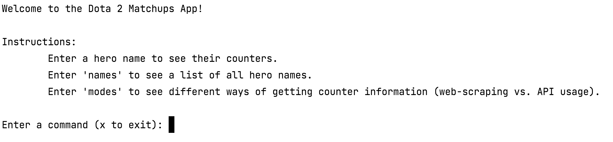
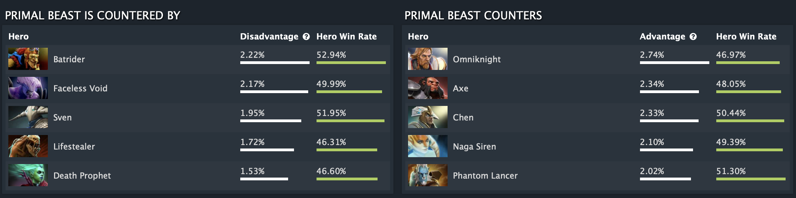
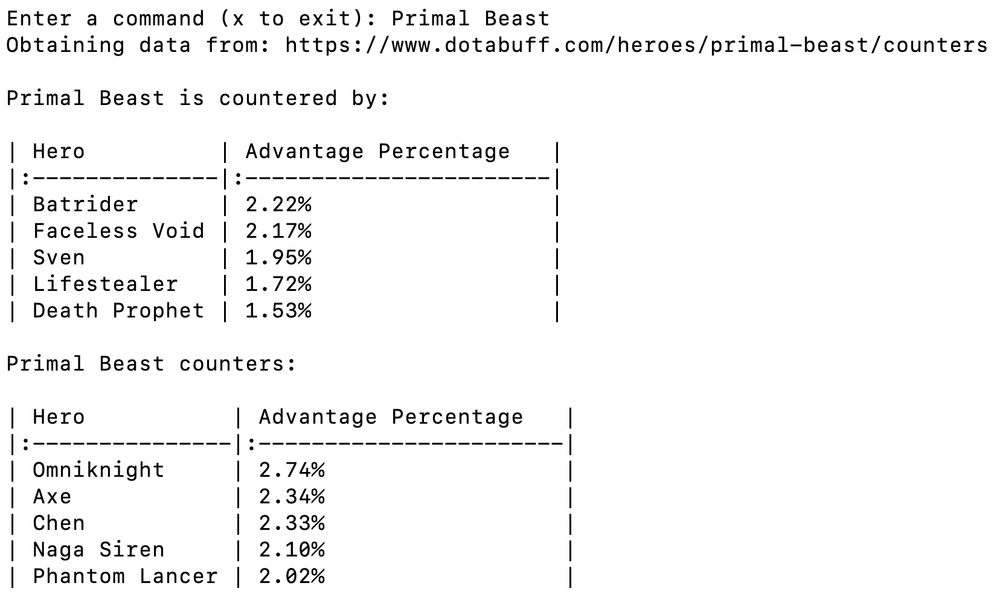
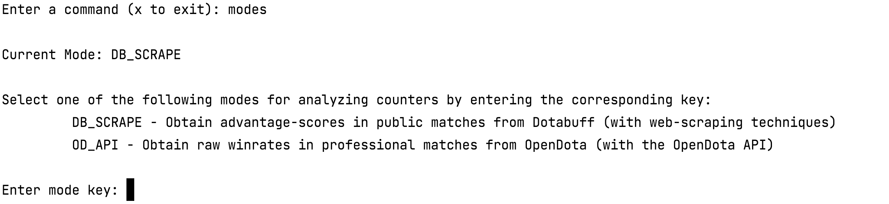

# Dota Matchups App
A command line interface app for obtaining basic counter information on Dota 2 heroes.

This app supports a choice of data-gathering methods (including web-scraping and API usage).

## Using the app

### Instructions

### Command: ***\<hero name\>***
Display counter information for the given hero based on the current mode.

DotaBuff.com web-scraping example:

### Command: ***modes***
Swap between web-scraping Dotabuff.com and using the OpenDota API.

